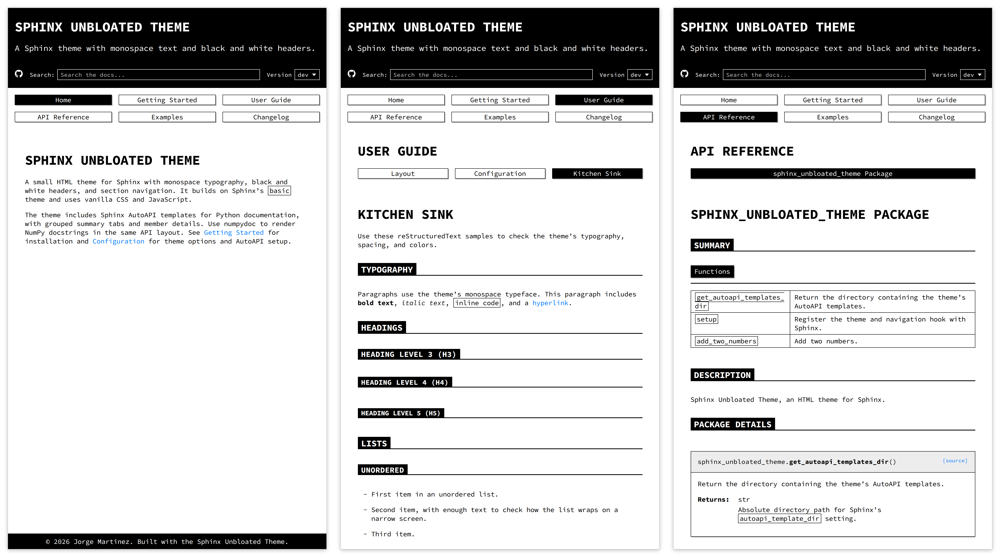

Sphinx Unbloated Theme
######################

A small HTML theme for Sphinx with monospace typography, black and white
headers, and section navigation. It builds on Sphinx's ``basic`` theme and
uses vanilla CSS and JavaScript.

The theme includes Sphinx AutoAPI templates for Python documentation, with
grouped summary tabs and member details. Use numpydoc to render NumPy
docstrings in the same API layout. See :ref:`getting-started` for installation
and :ref:`configuration` for theme options and AutoAPI setup.

.. toctree::
   :hidden:
   :maxdepth: 3

   getting-started
   user-guide
   api-reference
   examples
   changelog
